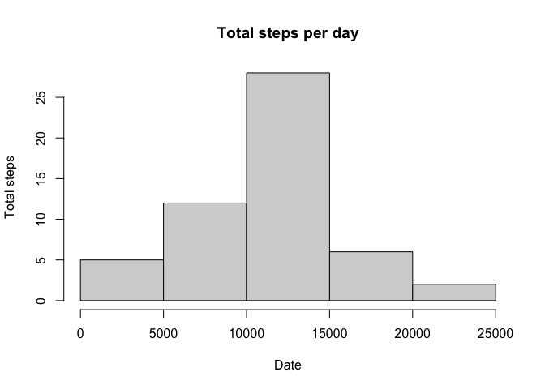
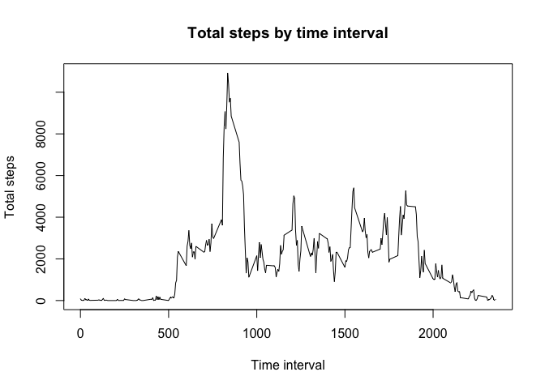
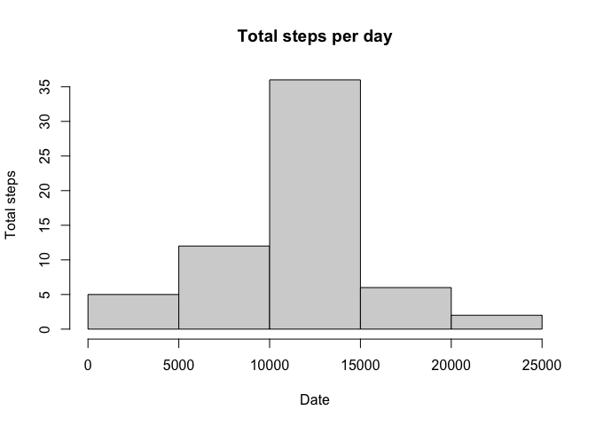
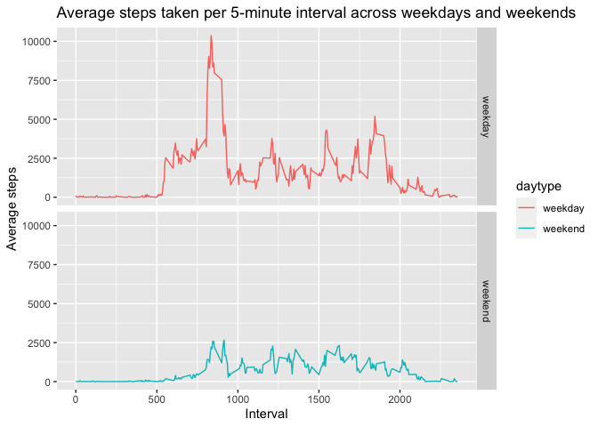

## Loading and preprocessing the data.
Since the .zip file is already in the working directory, I'll just unzip it. Check if the .csv file already exists in advance.

```r
filename <- "activity.csv"
if (!file.exists(filename)){
        unzip("activity.zip")
}
```
Read the data into R as data.frames.

```r
actData <- read.csv(filename, sep = ",", header = TRUE)
```

## What is mean total number of steps taken per day?
Calculate the total number of steps taken per day using the "aggregate()" function. And then make the histogram plot.

```r
actData_perday <- aggregate(steps ~ date, actData, sum)
hist(actData_perday$steps, main = "Total steps per day", xlab = "Date", ylab = "Total steps")
```

<!-- -->

We can also calculate the mean and median value of total steps per day.

```r
actData_mean <- mean(actData_perday$steps)
actData_median <- median(actData_perday$steps)
```
Here are the results:

```r
actData_mean
```

```
## [1] 10766.19
```

```r
actData_median
```

```
## [1] 10765
```

## What is the average daily activity pattern?
Make a time series plot (i.e. type = "l") of the 5-minute interval (x-axis) and the average number of steps taken, averaged across all days (y-axis).

```r
actData_bytime <- aggregate(steps ~ interval, actData, sum)
with(actData_bytime, plot(interval, steps, type = "l", main = "Total steps by time interval", xlab = "Time interval", ylab = "Total steps"))
```

<!-- -->

The 5-minute interval that, on average, contains the maximum number of steps:

```r
max_interval <- actData_bytime$interval[which.max(actData_bytime$steps)]
max_interval
```

```
## [1] 835
```

## Imputing missing values
First of all, let's calculate and report the total number of missing values in the dataset (i.e. the total number of rows with NAs).

```r
TotalNA <- sum(is.na(actData$steps))
TotalNA
```

```
## [1] 2304
```
Second, I'll devise a strategy for filling in all of the missing values in the dataset. The strategy does not need to be sophisticated. I use the mean for that interval.

```r
meanbyInterval <- aggregate(steps ~ interval, actData, mean)
```
Create a new dataset that is equal to the original dataset but with the missing data filled in. The strategy is basically to judge if there is a missing value in the "step" column, if so, substitude it with the mean for interval within the same time interval calculated on top.

```r
actData_Imputed <- actData
for (i in 1: nrow(actData_Imputed)){
        if (is.na(actData_Imputed$steps[i])){
                meanvalue <- meanbyInterval$steps[which(meanbyInterval$interval == actData_Imputed$interval[i])]
                actData_Imputed$steps[i] <- meanvalue
        }
}
```
After imputing the dataset, we can make the histogram and calculate for the mean and median again.

```r
actDataImputed_perday <- aggregate(steps ~ date, actData_Imputed, sum)
hist(actDataImputed_perday$steps, main = "Total steps per day", xlab = "Date", ylab = "Total steps")
```

<!-- -->

```r
actDataImputed_mean <- mean(actDataImputed_perday$steps)
actDataImputed_median <- median(actDataImputed_perday$steps)
```

Here are the results:

```r
actDataImputed_mean 
```

```
## [1] 10766.19
```

```r
actDataImputed_median
```

```
## [1] 10766.19
```

## Are there differences in activity patterns between weekdays and weekends?
I'll make a panel plot comparing the average number of steps taken per 5-minute interval across weekdays and weekends.  
First, convert the data to date format.

```r
actData_Imputed$date <- as.Date(actData_Imputed$date, "%Y-%m-%d")
```
And then, add columns define the day and type (weekday or weekend).

```r
actData_Imputed$day <- weekdays(actData_Imputed$date)
actData_Imputed$daytype <- c("weekday")
for (i in 1:nrow(actData_Imputed)){
        if (actData_Imputed$day[i] == "Saturday" || actData_Imputed$day[i] == "Sunday"){
                actData_Imputed$daytype[i] <- "weekend"
        }
}
```
Sum the data by intervals and daytypes (weekday or weekend).

```r
actDataImputed_bytime <- aggregate(steps ~ interval + daytype, actData_Imputed, sum)
```
Make the panel plot using ggplot2 package:

```r
library(ggplot2)
g <- ggplot(actDataImputed_bytime, aes(interval, steps, col = daytype))
g + geom_line() + facet_grid(rows = vars(daytype)) + 
        ggtitle("Average steps taken per 5-minute interval across weekdays and weekends") +
        ylab("Average steps") + xlab("Interval")
```

<!-- -->
